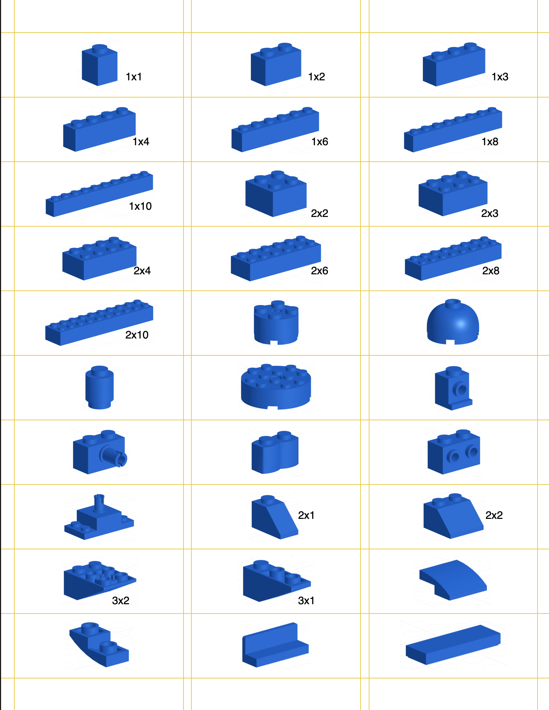

# lego-labels
Collection of lego labels.

These lables help my kids organize their legos on their own. It also helps me reset even if all of the tray gets dumped out accidentally...

All labels can be found in `dist/`.

Enjoy!

## Label Type

This package includes printable labels for Avery 18660 label template.  I like the [Matte Clear Address Labels](https://www.avery.com/products/labels/18660) because then you can see the label from inside and outside the trays.

Example:

## Contributing

To contribute, please see [CONTRIBUTING.md](./CONTRIBUTING.md)
